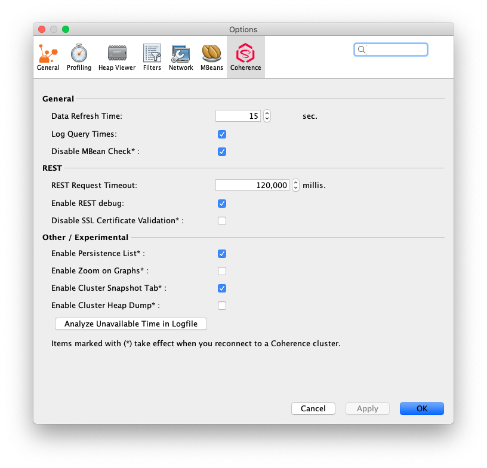

///////////////////////////////////////////////////////////////////////////////
Copyright (c) 2020, 2022 Oracle and/or its affiliates. All rights reserved.
DO NOT ALTER OR REMOVE COPYRIGHT NOTICES OR THIS FILE HEADER.

This code is free software; you can redistribute it and/or modify it
under the terms of the GNU General Public License version 2 only, as
published by the Free Software Foundation.  Oracle designates this
particular file as subject to the "Classpath" exception as provided
by Oracle in the LICENSE file that accompanied this code.

This code is distributed in the hope that it will be useful, but WITHOUT
ANY WARRANTY; without even the implied warranty of MERCHANTABILITY or
FITNESS FOR A PARTICULAR PURPOSE.  See the GNU General Public License
version 2 for more details (a copy is included in the LICENSE file that
accompanied this code).

You should have received a copy of the GNU General Public License version
2 along with this work; if not, write to the Free Software Foundation,
Inc., 51 Franklin St, Fifth Floor, Boston, MA 02110-1301 USA.

Please contact Oracle, 500 Oracle Parkway, Redwood Shores, CA 94065 USA
or visit www.oracle.com if you need additional information or have any
questions.
///////////////////////////////////////////////////////////////////////////////
= Coherence VisualVM Plugin

image::https://oracle.github.io/coherence/assets/images/logo-red.png[Coherence CE]

image:https://github.com/oracle/coherence-visualvm/workflows/Java%20CI%20-%20Released%20versions/badge.svg[CI Build]
image:https://img.shields.io/github/v/release/oracle/coherence-visualvm[Release]
image:https://sonarcloud.io/api/project_badges/measure?project=oracle_coherence-visualvm&metric=alert_status[Sonarcloud]

The Coherence-VisualVM Plugin (the Plugin) provides management and monitoring of a single Coherence cluster using the VisualVM management utility.

The Plugin aggregates Coherence MBean data and shows a concise operational view of a single Coherence cluster.
Some management information is presented over time, which allows real-time analysis and troubleshooting.
You can connect to clusters via JMX or via management over REST with Coherence versions 12.2.1.4 or above.

The Plugin is an ideal tool for monitoring and managing Coherence clusters during the development and testing lifecycle and supports connecting to both
Community Edition and Commercial versions of Coherence.

NOTE: This version of the Plugin requires VisualVM release 2.1 or later which is available from https://visualvm.github.io/.

image::assets/coherence-visualvm.png[Coherence VisualVM Plugin,800,479]

== Table of Contents

1. <<versions, Supported Coherence Versions>>
2. <<install, Installing the Plugin from VisualVM>>
3. <<connect, Connecting to a Coherence Cluster>>
4. <<prefs, Changing the Plugin Behaviour via the Options Tab>>
5. <<capabilities, Monitoring Capabilities>>
6. <<build, Building the Plugin>>

[#versions]
== Supported Coherence Versions

The Plugin will connect to and display data for the following Coherence versions:

**Community Editions**: 14.1.1.0.x, 20.06.x, 20.12.x, 21.06.x, 21.12.x and 22.06.x

**Commercial Editions**: 14.1.1.0.x, 12.2.1.5.x, 12.2.1.4.x, 12.1.3.x, 12.1.2.x and 3.7.1.x (Support will be dropped for versions 12.1.3.x and older in an upcoming release)

NOTE: If you wish to connect to Coherence version 12.2.1.4.x via REST you should have Coherence version 12.2.1.4.7 or greater.

[#install]
== Installing the Plugin from VisualVM

The Coherence VisualVM Plugin is available from the list of plugins in VisualVM versions 2.0.6 and above. It is recommended
to install the latest VisualVM version 2.1 to ensure you can install the most up-to-date Coherence Plugin.

To install the Plugin carry out the following:

1. Choose `Tools` -> `Plugins` from the main menu.
2. The Plugin will be displayed as `VisualVM-Coherence`. If it is not present in the list then click on the `Check for Newest` button
3. In the `Available Plugins` tab, select the Install checkbox for the `VisualVM-Coherence`. Click Install.
4. Step through and complete the plugin installer.

image::assets/coherence-visualvm-install.png[Coherence VisualVM Plugin Install,800,479]

NOTE: If you already have an older version of the plugin installed, click on `Check For Newest` and follow the prompts.

For more information about using the Coherence VisualVM plugin see the official https://docs.oracle.com/en/middleware/standalone/coherence/14.1.1.0/manage/using-jmx-manage-oracle-coherence.html[Coherence Documentation].

Other useful resources:

* https://coherence.community/[The Coherence Community - All things Coherence]
* https://visualvm.github.io/[VisualVM Home Page]
* https://github.com/oracle/coherence[Coherence Community Edition on GitHub]
* https://coherence.community/latest/22.06/docs/#/examples/README[Various Coherence Examples]
* https://github.com/oracle/coherence-operator[The Coherence Operator - Run your clusters in Kubernetes]

[#connect]
== Connecting to a Coherence Cluster

=== 1. Connecting Directly to a Process

Once the Plugin is installed, you can double-click on a Coherence process in the left pane, usually `com.tangosol.net.DefaultCacheServer`, after which a `Coherence` tab will be displayed.

=== 2. Connecting via Management over REST

You can also connect via Coherence Management over REST by right-clicking on the `Coherence Clusters` tree item and choose `Add Coherence Cluster`.

Provide a name for the cluster and use the following URL based upon what type of cluster you are connecting to:

1. Standalone Coherence - `http://<host>:<management-port>/management/coherence/cluster`

2. WebLogic Server -  `http://<admin-host>:<admin-port>/management/coherence/<version>/clusters` - You can use `latest` as the version.

NOTE: To enable Management over REST for a stand-alone cluster, please see the
https://docs.oracle.com/en/middleware/standalone/coherence/14.1.1.0/rest-reference/quick-start.html[Coherence Documentation].

=== 3. Connecting to Coherence in WebLogic Server via the Admin Server

If you have Coherence running within WebLogic Server using the `Managed Coherence Servers` functionality you can either
connect via REST as described above or if you want to connect to the `domain runtime MBean server`, use the instructions below.

1. Ensure you have the same version of WebLogic Server installed locally as the instance you are connecting to.

2. Use the following (on one line) to start VisualVM replacing WLS_HOME with your WebLogic Server home.
+
[source,shell]
----
/path/to/visualvm --cp WLS_HOME/server/lib/wljmxclient.jar:WLS_HOME/server/lib/weblogic.jar
   -J-Djmx.remote.protocol.provider.pkgs=weblogic.management.remote
   -J-Dcoherence.plugin.visualvm.disable.mbean.check=true
----
+
NOTE: On a Mac, the default VisualVM installed is usually `/Applications/VisualVM.app/Contents/MacOS/visualvm`.
For Windows ensure that you use `visualvm.exe` and change the `/` to `\` and change the classpath separator from `:` to `;`.

3. From the VisualVM Applications tree, right-click `Local` and select `Add JMX Connection`. The Add JMX Connection dialog box displays.

4. Use either of the following connect strings depending upon the WebLogic Version you are connecting to.
+
For WebLogic Server 14.1.1.X and above use **t3** protocol:
+
[source,shell]
----
service:jmx:t3://hostname:port/jndi/weblogic.management.mbeanservers.domainruntime
----
+
For WebLogic Server 12.2.1.5 and below use **iiop** protocol:
+
[source,shell]
----
service:jmx:iiop://hostname:port/jndi/weblogic.management.mbeanservers.domainruntime
----
+
NOTE: in WebLogic Server 14.1.1.x and above the `wljmxclient.jar` no longer exists and will be ignored in the classpath.
You may remove it from the above `--cp` statement if you like.

5. Click `Use security credentials` and enter the WebLogic Server username and password.

6. Check `Do not require SSL connection` if your connection is not SSL and select `Connect Immediately`.

7. Right-Click on the connection and select `Open`. The Coherence tab will be displayed.

NOTE: If you wish to secure access to the REST endpoints or via JMX, please refer to either the https://docs.oracle.com/en/middleware/standalone/coherence/14.1.1.0/index.html[Coherence Documentation]
or relevant JMX security documentation.

[#prefs]
== Changing the Plugin Behaviour via the Options Tab

In version 1.0.1 or above of the VisualVM Plugin, you can change the behaviour of the plugin
by using the Options pane. To open the options choose the following depending upon your platform:

1. Mac:  `VisualVM` -> `Preferences` and select the `Coherence` tab.

2. Windows/Linux: `Tools` -> `Options` and select the `Coherence` tab.

You will see the preferences as shown below:

There are tool tips for each of the preferences, but a summary is shown below.

.Table Coherence VisualVM Preferences
!===
|Preference | Default | Usage
| Data Refresh Time| 30 |  Time (in seconds) between refreshing data from the cluster. Do not set too low as this could adversely affect performance in large clusters.
| Log Query Times| false | Enables logging of query times to the VisualVM logfile when retrieving data.
| Disable MBean Check | false | Disables the MBean check when connecting to WebLogic Server. This allows the plugin to startup without checking for Cluster MBean.
| REST Request Timeout | 30000 | The request timeout (in ms) when using REST to connect to a cluster.
| Enable REST Debug | false | Enables HTTP request debugging when using REST to connect to a cluster.
| Disable SSL Certificate Validation| false | If selected, will disable SSL certificate validation. Note: You should only use this option when you are sure of the identify of the target server.
| Enable Persistence List | true | Enables dropdown list of snapshots rather than having to enter the snapshot when performing snapshot operations.
| Enable Zoom on Graphs | false | Enables additional zoom function for all graphs.
| Enable Cluster Snapshot tab | false | Enables experimental Cluster Snapshot tab. This tab is useful for seeing all the relevant cluster information on one pae in a text format.
| Enable Cluster Heap Dump | false | Enables the cluster heap dump button on the Cluster Overview tab.
| Analyze Unavailable Time in LogFile| | Provides the ability to analyze log files where Partition Events Logging has been enabled for logs generated from Coherence versions 21.06 and above. See https://docs.oracle.com/pls/topic/lookup?ctx=en/middleware/standalone/coherence/14.1.1.2206/release-notes&id=COHDG-GUID-41F5341C-0318-41B2-AEBF-B9DB7FBF25E7[here] for more details. Note: You select a Coherence log file to analyze and don't need to be connected to a running cluster.
!===

[#capabilities]
== Monitoring Capabilities

For all Coherence clusters, the following tabs are displayed:

* **Cluster Overview** - Displays high-level information about the Coherence cluster including cluster name, version, member count and 'Cluster StatusHA'. Summary graphs show total cluster memory available and used, packet publisher and receiver success rates and load averages for machines running Coherence.
* **Machines** - Displays a list of the physical machines that make up the Coherence cluster as well as information about the load averages and available memory on these machines.
* **Members** - Displays the full list of Coherence members/nodes including individual publisher/ receiver success rates, memory and send queue sizes.
* **Services** - Displays information about the running services including partition counts and statusHA values.
If you select a service, on the next data refresh you will see detailed thread information for each node of the service as well as
graphs of that information
* **Caches** - Displays information about any caches including size, and memory usage information. To get the correct information to be displayed for memory usage, you must be using the binary unit-calculator. If you select a cache, on the next data refresh you will see detailed information about each node hosting that service and cache.

Depending upon the edition and functionality you are using, the following optional tabs may be displayed:

* **Proxy Servers**  - If your cluster is running proxy servers, this tab displays information about the proxy servers and the number of connections across each proxy server and total connections.
* **HTTP Servers**  - If your cluster is running proxy servers with HTTP acceptors, this tab displays information about the HTTP servers, the number of connections across each server, total connections and graphs of response codes, errors and requests over time for a selected service.
* **Executors** - If your cluster is configured to run the Executor Service, this tab displays information about the number of tasks completed, in-progress and rejected.
* **Coherence*Web** - If your cluster is configured for Coherence*Web, this tab displays information about the number applications deployed, the number of HTTP sessions being stored as well as other information regarding session reaping.
* **Federation** - If your cluster is configured with Federated Caching, this tab displays information about each federated service. If you select a service, on the next data refresh you will see detailed outbound/inbound federation traffic information for each node of the service as well as graphs of that information.
* **Persistence** - If your cluster is configured with Persistence, this tab displays information about each service configured with Persistence.  Graphs showing active space used and any additional latencies incurred are also showed.
* **Elastic Data** - If your cluster is configured with Elastic Data, this tab displays graphs and information about RAM Journal and Flash Journal usage.  You can click on each of the usage bars to show detailed node information
* **JCache** - If your cluster is being used to store JCache caches, this tab displays JCache "Management" and "Statistics" MBean information regarding the configured caches.
* **HotCache** - If your cluster contains HotCache node(s), then this tab lists the running HotCache instances. If you select an instance, on the next data refresh the console will display statistics and graphs for the operations performed. You may click on tabs and cache-ops to see further fine-grained information.
* **gRPC Proxies** – If your cluster is configured with gRPC Proxies, this tab displays information about the requests sent and received as well as successful and failed requests. A Graph of message rates and durations is also displayed. This tab will only show when connected via JMX and is not supported for REST connections.
* **Health** – If your cluster supports the Health Check API, this tab displays information regarding the status of all health endpoints.

[#build]
== Building the Plugin

If you wish to build the Plugin from scratch please follow the instructions below.

=== Pre-requisites

You must have the following:

1. Java JDK 11+ - To build and test the plugin
2. Maven 3.6.3+
3. Git

=== Clone the Repository

1. Clone the Coherence VisualVM repository
+
[source,shell]
----
$ git clone https://github.com/oracle/coherence-visualvm.git
----

==== Build the VisualVM Plugin

1. Ensure you have JDK11 or above in your PATH.

2. Build the Plugin
+
From the `coherence-visualvm` directory:
+
[source,shell]
----
$ mvn clean install -DskipTests
----
+
If you wish to run the Community Edition tests then leave out the `-DskipTests`.

3. Install the Plugin
+
The plugin will be available in the location `coherence-visualvm-plugin/target/coherence-visualvm-plugin-{version}.nbm`

Follow the instructions https://docs.oracle.com/en/middleware/standalone/coherence/14.1.1.0/manage/using-jmx-manage-oracle-coherence.html[here]
to install the plugin manually.
